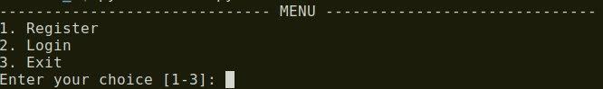
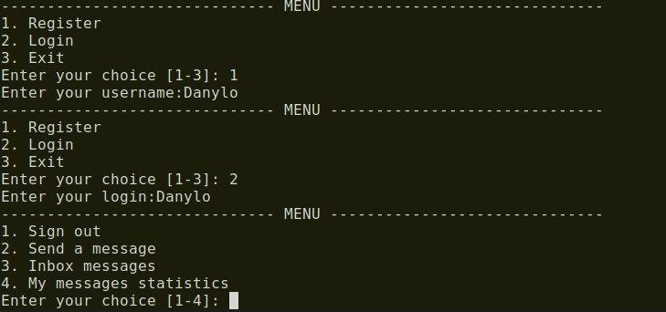
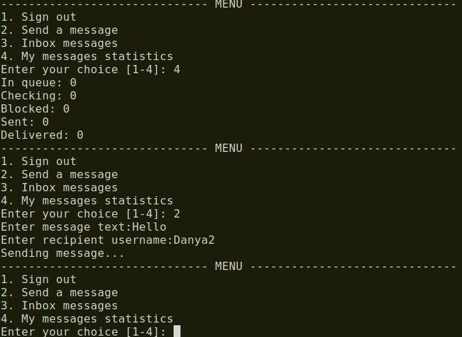
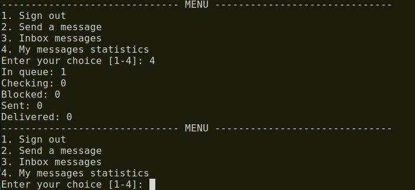
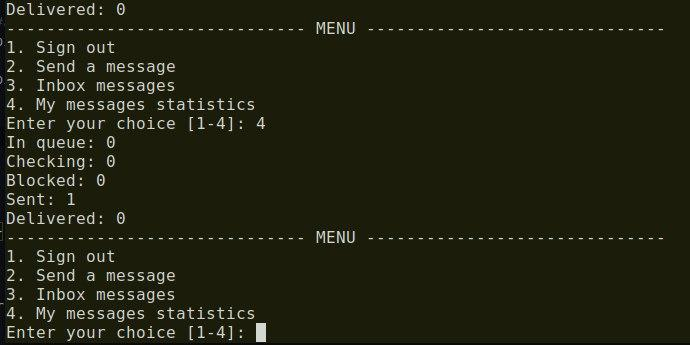
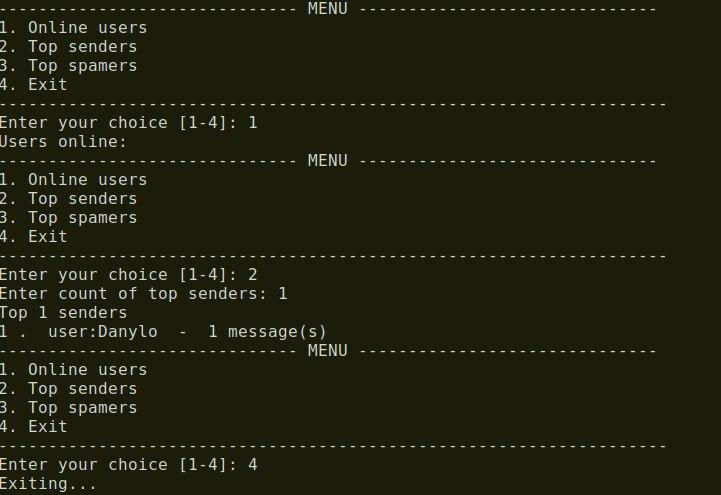

# Лабораторна робота No 2. Практика використання серверу Redis

## Виконавець

Гулько Данило Тарасович. Группа КП-73

## Завдання 

[Посилання на завдання](http://scs.kpi.ua/sites/default/files/lab2_bd2-db2019_2020.pdf)

## Структура даних
Користувачі системи зберігаються у вигляді структури даних Set. Для зберігання користувачів не важливий порядок, але важлива швидкість доступу. Сет характеризується саме такими якостями. 

Повідомлення зберігаються у вигляді Hash таблиці. Цей тип даних дозволяє зберегти ключ та значення, що було використано для зберігання інформації про ім'я користувача-відправника, користувача-отримувача, а також власне текст повідомлення. Ключем виступає ідентифікатор повідомлення, що для кожного нового запису збільшується на одиницю.

Для черги повідомлень використувоється структура List, так як у данному випадку необхідно зберегти порядок доданих записів. Також важливо помітити, що операції по вилученню та вставці елементів у кінець та початок списку проходять за одиницю часу.

## Приклади роботи програми

